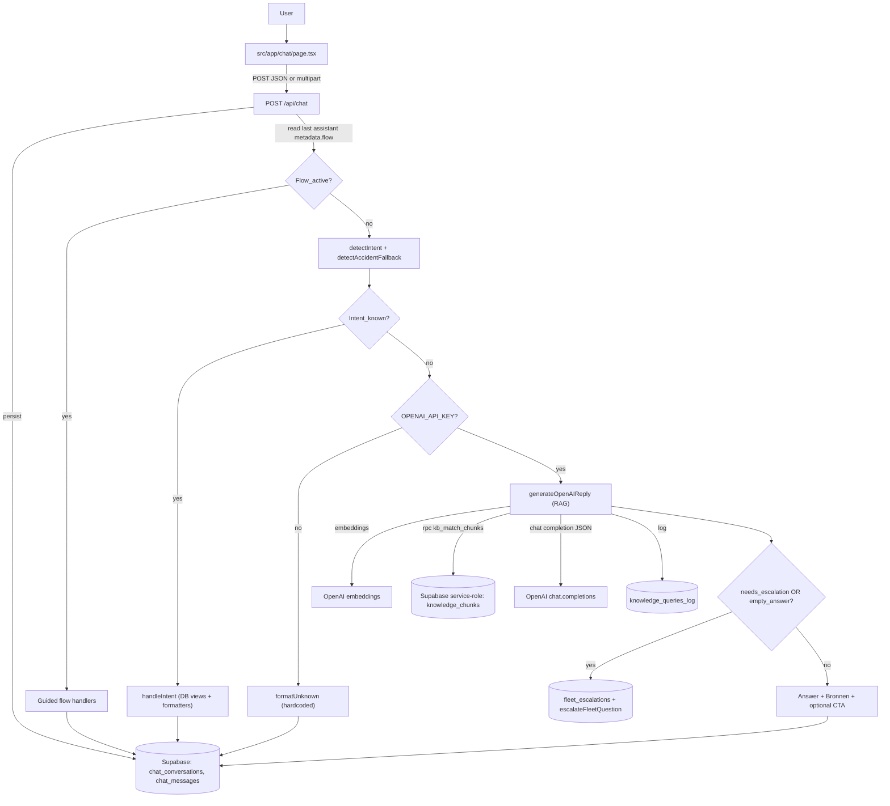

# Chatbot deep-dive (AI vs hardcoded)

Dit document beschrijft, sectie per sectie, **hoe de chatbot in deze app gebouwd is**, **welke bronnen worden gebruikt**, en **waar het deterministisch is** (rules/flows/DB) versus **niet-deterministisch** (LLM+RAG).

---

## 1) Routing overview (call graph + beslissingspunten)



### Samenvatting “AI vs hardcoded”

- **Deterministisch**: flow routing, intent detectie, alle “known intents” handlers, DB view queries, formatters, CTA-regels, attachment upload/signing.
- **Niet-deterministisch**: enkel in de OpenAI-path (antwoordinhoud + `needs_escalation` + `used_sources`), en indirect de KB hitset (embeddings + vector search).

---

## 2) A. Entry points & message lifecycle (UI → API → history)

### UI: `src/app/chat/page.tsx`

- **Send**:
  - JSON POST wanneer geen files
  - `multipart/form-data` wanneer er bijlagen zijn
- **History reload**: `GET /api/chat/messages` (server-side) om persisted chat + signed URLs op te halen
- **Optimistic UI**: user message verschijnt meteen, daarna volgt `loadMessages()`

### Server: `POST /api/chat` (`src/app/api/chat/route.ts`)

- Auth: Supabase `getUser()` (email vereist)
- Attachments (optioneel): upload + signed URLs → **worden toegevoegd aan prompt** in `[Bijlagen]`
- Persist:
  - `chat_conversations`: conversatie id per user
  - `chat_messages`: user message + attachments + assistant response met metadata
- Routing: eerst guided flow (op basis van `metadata.flow`), daarna intent detectie, daarna pas OpenAI fallback

### Server history endpoint: `GET /api/chat/messages` (`src/app/api/chat/messages/route.ts`)

- Laadt persisted chat voor ingelogde user
- Tekent attachments opnieuw met signed URLs server-side (service role waar beschikbaar)

### Persisted shape: `src/lib/queries/chat-history.ts`

- `chat_conversations`: `id`, `user_id`
- `chat_messages`:
  - `role`: `user | assistant | fleet_manager`
  - `attachments`: `{ bucket, path, name, mime }[]`
  - `metadata` (assistant): `intent`, `title`, `cards`, `suggestions`, `cta`, `flow`

---

## 3) B. Deterministische routinglaag (rules)

### Centrale router: `src/app/api/chat/route.ts`

Volgorde:

1. **Guided flow routing**: als laatste assistant `metadata.flow` bevat, dan gaat de volgende user message naar de flow handler.
2. **Intent detectie**: `detectIntent(userFacingContent)`.
3. **Accident fallback**: als intent `unknown` maar broad accident match: force `accident_report`.
4. **LLM fallback**: enkel als intent nog `unknown` is én `OPENAI_API_KEY` gezet is.

Belangrijke nuance:

- Intent detectie gebeurt bewust op `userFacingContent` (wat de user typte), **niet** op `effectiveMessage` (wat ook `[Bijlagen]` signed URLs bevat). Dat is een hardcoded guard tegen false positives zoals `my_documents`.

### Intent rules: `src/lib/intent/router.ts`

- **100% deterministisch**: priority-ordered regex patterns, daarna keyword fallback.
- **Order matters** (bv. `new_car_order` vóór `allowed_options`).

---

## 4) C. Deterministische handlers (DB-backed, geen LLM)

### Dispatcher: `src/lib/intent/handlers.ts`

`handleIntent()` is een switch-case over `ChatIntent` en routeert naar:

- DB reads via views + formatter
- hardcoded CTA’s
- guided flow start
- `formatUnknown()` fallback

### Databronnen (deterministisch, per intent)

- **Vehicle/contract/docs/insurance**:
  - Query: `src/lib/queries/fleet.ts`
  - View: `v_fleet_assistant_context`
- **Allowed options / best range**:
  - Query: `src/lib/queries/options.ts`
  - View: `v_allowed_vehicle_options`
- **Charging / reimbursements**:
  - Query: `src/lib/queries/charging.ts`
  - View: `v_charging_sessions_overview`
- **Hardcoded CTA intents**:
  - `accident_report` → CTA `/ongeval`
  - `new_car_order` → CTA `/wagen-bestellen`
- **Unknown zonder OpenAI key**:
  - `formatUnknown()` → statische tekst “Niet herkend”

Determinisme nuance:

- Deze paden zijn deterministisch **gegeven de database state**. De output kan veranderen wanneer view-data verandert, maar er is geen probabilistisch model in deze route.

---

## 5) D. Guided flows (hardcoded state machines)

Er zijn 2 flows:

- `tire_change` (bandenwissel)
- `lease_return_inspection` (inleveren/inspectie)

### Hoe flow routing werkt

- Flow state wordt opgeslagen in `chat_messages.metadata.flow` (assistant message).
- Volgende user message wordt (op server) eerst aan de flow handler aangeboden vóór intent detectie.

### Waarom dit “rule bound / hardcoded” is

- Tokens als `Volgende`, `Vorige`, `Stop` zijn letterlijk hardcoded.
- Step content is vooraf uitgeschreven; geen KB/DB/LLM wordt geraadpleegd tijdens de flow steps.

---

## 6) E. LLM-pad: `unknown` → OpenAI + RAG (niet-deterministisch)

### Voorwaarden om OpenAI te gebruiken

- `detectIntent(...)` geeft `unknown`
- `OPENAI_API_KEY` is aanwezig
- Dan: `generateOpenAIReply()` (`src/lib/openai/fleet-chat.ts`)

### Wat deterministisch blijft in de LLM-route

- Retrieval pipeline:
  - embeddings maken
  - `rpc("kb_match_chunks")`
  - context block opbouw met limiet
- Bronnen formatter:
  - `sourcesUsed` (dedupe op `title::source_ref`)
  - “Bronnen:” blok wordt deterministisch appended (met gesanitized indices)
- PDF CTA regel:
  - eerste `source_ref` die `public/...` en `.pdf` matcht → CTA
- Follow-up shortcuts (hardcoded):
  - exact `"Meer details"`, `"Voorbeeld"`, `"PDF downloaden"` → baseQuestion wordt deterministisch teruggezet naar laatste `knowledge_queries_log.query_text`

### Wat niet-deterministisch is

- `answer` inhoud (LLM output)
- `needs_escalation`
- `used_sources` (wel gesanitized en afgekapt)

---

## 7) F. Knowledge base: storage, vector search, ingest & runtime retrieval

### DB schema + RPC

De runtime RAG gebruikt:

- Tabellen:
  - `knowledge_documents`
  - `knowledge_chunks` (met `embedding vector(1536)`)
  - `knowledge_queries_log`
  - `fleet_escalations`
- RPC:
  - `kb_match_chunks(query_embedding, top_k, min_similarity)` → top-k chunks + `similarity`

### RLS intent

- End users lezen KB tables niet direct; retrieval gebeurt via service-role client (`SUPABASE_SERVICE_ROLE_KEY`).
- `knowledge_queries_log` heeft policies om enkel “eigen conversation” te selecteren/inserten.

### Admin upload + ingest

- Admin UI: `src/app/admin/knowledge-base/*`
- Upload API: `src/app/api/admin/kb-documents/upload/route.ts`
  - Storage bucket: `kb-documents`
  - Insert `knowledge_documents` (source_type = `upload`, source_ref = `storage:kb-documents/...`)
- Ingest API: `src/app/api/admin/kb-documents/ingest/route.ts`
  - Download uit bucket, delete bestaande chunks, dan extract/chunk/embed/insert
- Parsers: `src/lib/kb/ingest.ts`
  - PDF: `pdfjs-dist`
  - DOCX: `mammoth`
  - Fallback: UTF-8 text

### Storage bucket policies

- `kb-documents` bucket policies (insert/select/update/delete) laten enkel `fleet_manager`/`management` toe (via `medewerkers.rol`).

---

## 8) G. Bronnen/citations: wat wordt getoond aan de gebruiker

- Retrieval bouwt `sourcesUsed` als lijst `{ title, source_ref }`.
- Model geeft `used_sources` indices terug.
- Response voegt “Bronnen:” toe met `- title (source_ref)` (max 3).
- CTA “PDF downloaden” verschijnt deterministisch als een bron `public/*.pdf` is.

Belangrijke interpretatie:

- De UI “verwijst” naar **document titels + refs**, niet naar chunk IDs.
- Chunk IDs worden wel gelogd in `knowledge_queries_log.retrieved_chunk_ids`.

---

## 9) H. Bijlagen (attachments) en hun impact

### Upload + prompt injectie

- `src/lib/chat/process-uploads.ts` uploadt bijlagen naar Storage en maakt signed URLs.
- Die URLs worden toegevoegd aan de LLM prompt als:

```
[Bijlagen]
- bestand1.pdf: https://signed-url...
- foto.png: https://signed-url...
```

### Deterministische guard

- Intent detectie gebruikt bewust enkel `userFacingContent` (dus niet de bijlage-URLs).

### Praktische beperking

- De LLM krijgt bijlagen als URL strings; zonder extra tooling/parse pipeline kan hij de inhoud niet betrouwbaar verwerken.

---

## 10) I. Escalatie: wanneer “AI” stopt en menselijke opvolging start

- Trigger: `needs_escalation=true` of leeg antwoord.
- Daarna:
  - insert `fleet_escalations`
  - `escalateFleetQuestion()` vult subject/body met vraag + top bronnen + optionele conversatie-link.
- Email sending is momenteel uitgeschakeld; escalaties zijn bedoeld voor in-app opvolging.

---

## 11) Bronnenmatrix (per pad)

### Deterministische intents

- Views: `v_fleet_assistant_context`, `v_allowed_vehicle_options`, `v_charging_sessions_overview`
- Table: `medewerkers` (voornaam)
- CTA routes: `/ongeval`, `/wagen-bestellen`, `/laadkosten`, `/api/insurance/attest`

### Guided flows

- Geen DB/KB reads tijdens steps
- Alleen flow-state via `chat_messages.metadata.flow`

### LLM + KB (RAG)

- OpenAI: embeddings + chat completion
- Supabase service role:
  - `rpc("kb_match_chunks")`
  - insert `knowledge_queries_log`
  - insert/update `fleet_escalations`

### Attachments

- Storage bucket: `CHAT_ATTACHMENTS_BUCKET`
- Signed URL TTL:
  - prompt: 7 dagen
  - history: 24 uur

### KB ingest (admin)

- Storage bucket: `kb-documents`
- Tables: `knowledge_documents`, `knowledge_chunks`
- Parsers: PDF/DOCX/text

---

## 12) Edge cases / opvallende details

### Manager intents zijn “stubs”

- Ze bestaan in `ChatIntent` en `handleIntent`, maar worden niet herkend door `detectIntent` rules, dus via gewone chat prompts zijn ze typisch onbereikbaar.

### KB ingest kan dubbele documents creëren

- Upload route insert `knowledge_documents`.
- Ingest helper `ingestKnowledgeDocument()` insert ook een nieuwe `knowledge_documents` row.
- Gevolg: je kan meerdere actieve docs krijgen met dezelfde titel/source_ref waarbij chunks aan de “nieuwere” row hangen.

### Follow-ups zijn strikt token-based

- Alleen exact `"Meer details"`, `"Voorbeeld"`, `"PDF downloaden"` triggert de log-based herformulering.

